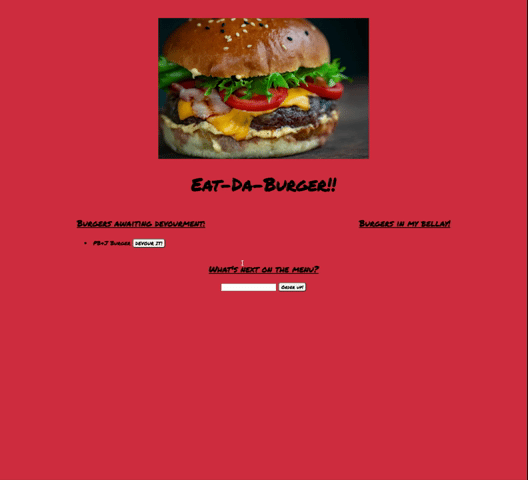

# Eat-Da-Burger!

## Description

This application uses MySQL, Node, Express, Handlebars, and a custom ORM to allow a user to input the burgers they want to eat into a list and then once they eat them, they will be moved into the "devoured" list.

## Table of Contents

* [Links](#links)

* [Usage](#usage)

* [Learning Outcomes](#learning-outcomes)

* [Conclusion](#conclusion)

## Links

* [GitHub Repo](https://github.com/elizabethbrandt/eat-da-burger)

* [Heroku Deployment](https://eb-eat-da-burger.herokuapp.com/)

## Usage

* The main accomplishment with this application is the use of the database. The information is no longer stored just locally, instead, if anybody types the link into their browser, they will see all the same information.

* When a user adds their burgers into the "Awaiting Devourment" list, it will remain there until they click "Devour It!"

## Learning Outcomes

#### MVC and custom ORM

* The concept that helped me with the MVC model was the boomerang. The user interacts with the page, calling the controller, which calls the model, which calls the ORM that is performing the CRUD methods. That interacts with the data, brings it back to the model, back the controller, and last to the views which is what the user sees.

#### Arrow Functions

* I learned the limit of arrow functions this last week. In my client side JS file, I was using an arrow function for capturing `this.id` and was struggling to get the id to be populated into the rest of the application. I learned that, while arrow functions are great, there are limitations to when one can use them. An arrow function binds context statically and not dynamically. So in the case of `this`, it needs the more standard `function` syntax in order to create the dynamic nature of pulling information depending on where the user clicks.

## Conclusion

This activity was actually a really exciting checkpoint for me as I'm starting to piece together all the things I'm learning and feeling like I can actually apply this knowledge to build more exciting applications. Though the activity itself has no real-life use, the concepts I'm learning are so valuable and I can't wait to learn more.